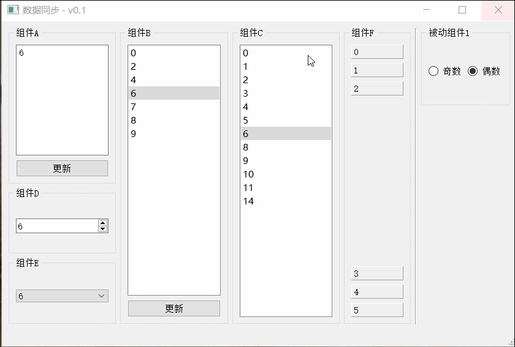

# 用户界面数据(状态)同步的解决方案

Create by tyw66 at 2021-9-7

## 问题

当某个组件使得整个系统的某个状态变化后，界面其余各个组件如何及时做出相应的变化响应。
  
## 解决方案

系统状态改变的情形提炼成一个个信号，放在独立的一个公用模块中。

运行过程中，各个模块通调用这个公用模块去发送相应信号。

各个模块对象实现自己的槽函数，并去连接这些信号，做出相应的响应。

***注意[重要]：为了避免在对象的槽函数中改变状态导致又触发信号，这时需要把阻断对象的信号发送，在槽函数开始时使用函数blockSignals(true)阻断.在槽函数响应结束时再恢复。***

信号槽传递的参数建议是QString或者QVariant

## 效果

 
